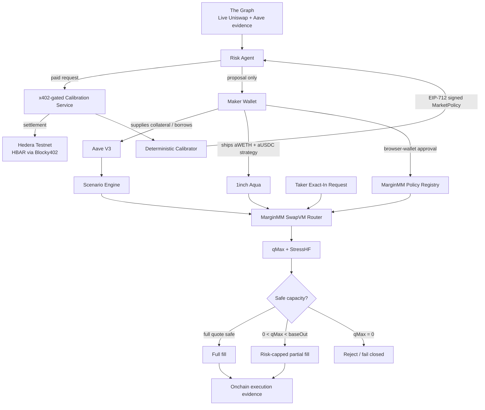

# MarginMM

**Collateral-aware market making for leveraged Aave V3 positions, enforced inside 1inch Aqua / SwapVM execution.**

MarginMM answers one question:

> **How much of a leveraged maker's liquidity is actually safe to execute right now?**

A maker can have WETH and USDC collateral on Aave, borrow USDC against it, and use the same aToken-backed position as market-making liquidity through 1inch Aqua. The problem is that a large fill can change the maker's collateral composition and consume liquidation headroom.

MarginMM combines:

- **Aave V3** for the maker's live lending position.
- **The Graph** for live market and protocol evidence.
- **A deterministic calibrator** that turns that evidence into a signed WETH downside stress policy.
- **Hedera + x402** for agentic pay-per-request calibration.
- **1inch Aqua + SwapVM** for execution, including a custom risk instruction that enforces `qMax` inside the swap path.

---

## Core idea

For every executable quote, MarginMM calculates:

- **Current HF** — the maker's live Aave Health Factor.
- **StressHF** — the Health Factor after applying the active signed WETH downside shock.
- **Maker Floor** — the minimum stressed Health Factor the maker is willing to accept.
- **`qMax`** — the maximum output that can be executed while keeping the post-trade StressHF at or above the Maker Floor.

The execution rule is:

```text
post-trade StressHF >= Maker Floor
```

If the full XYC quote is safe, the trade fills normally.

If the full quote is too risky but some capacity remains:

```text
baseOut > qMax > 0
```

MarginMM performs a **risk-capped partial fill** and recomputes the actual input using the same XYC pricing math.

If no safe capacity remains:

```text
qMax = 0
```

the quote is rejected and the system fails closed.

---

## Why this is different

A binary risk guard has only two outcomes:

```text
safe   → execute everything
unsafe → execute nothing
```

MarginMM instead preserves the maximum safe executable amount:

```text
requested trade
      ↓
XYC base output
      ↓
live Aave state + signed stress policy
      ↓
qMax
      ↓
full fill / partial fill / reject
```

---

# Architecture



---

# 1inch Aqua + SwapVM

MarginMM is built as a custom Aqua app using the official 1inch Aqua / SwapVM stack.

The maker ships an immutable WETH/USDC XYC strategy to Aqua. MarginMM then extends the SwapVM execution program with its own mandatory risk instruction.

The router pins the SwapVM instruction layout and adds:

```solidity
MARGIN_RISK_OPCODE = 46;
```

The canonical instruction path includes:

```text
SALT
→ XYC_CONCENTRATE
→ XYC_SWAP
→ MARGIN_RISK
```

The risk check therefore runs **inside the execution path**, rather than as an optional frontend warning.

## Exact-In execution

The demo supports both directions:

```text
aWETH in → aUSDC out
aUSDC in → aWETH out
```

For each request, the taker specifies:

- **Maximum input** — the most they are willing to send.
- **Minimum output** — minimum-output protection for the final fill.

MarginMM then computes:

```text
Requested Input
→ Base XYC Output
→ Safe Executable Capacity (qMax)
→ Actual Input
→ Final Output
```

The UI distinguishes:

- **Full exact-in fill**
- **Liquidity-capped partial fill**
- **Risk-capped partial fill**
- **Quote rejected / no capacity**

After execution, the UI records the confirmed transaction and the `MarginRiskEvaluated` evidence from the browser session.

### 1inch bounty alignment

MarginMM uses:

- Official Aqua / SwapVM contracts.
- A modified SwapVM execution program with a custom instruction.
- Real token-transfer execution on a pinned Ethereum mainnet fork.
- UI-visible requested vs actual input, base vs final output, `qMax`, StressHF, and transaction hash.

---

# Aave V3 risk engine

The current MVP uses Ethereum Aave V3 semantics on a pinned Ethereum mainnet fork.

Supported position shape:

```text
Collateral:
- WETH
- USDC

Debt:
- variable-rate USDC
```

`MarginMMScenarioEngine` reads the maker's actual Aave state, including collateral balances, debt, liquidation thresholds, reserve indices, Aave oracle prices, and current Health Factor.

The engine applies the active signed WETH downside shock and recomputes the stressed position.

```text
Current HF = current Aave lending health
StressHF   = lending health after the active WETH downside shock
```

The maker independently chooses a **hard StressHF floor**.

This separates:

```text
market risk calibration
        from
maker risk tolerance
```

The market determines the stress scenario; the maker determines how much stressed risk they are willing to accept.

---

# The Graph — live, load-bearing risk data

The Graph is not used as a dashboard-only integration.

MarginMM queries live Graph data for:

## Uniswap V3 Ethereum

WETH/USDC 0.05% pool:

```text
0x88e6A0c2dDD26FEEb64F039a2c41296FcB3f5640
```

The market evidence includes hourly WETH/USDC observations, OHLC data, volume and TVL, first/last swap block ranges, and indexed deployment metadata.

## Aave V3 Ethereum

The Graph also supplies live Aave reserve and liquidation evidence for WETH and USDC.

The evidence pipeline rejects invalid conditions such as indexing errors, malformed responses, wrong market assets, unsupported Aave reserve state, and invalid market evidence.

## Deterministic calibration

The AI model does **not** invent the risk number.

MarginMM deterministically calculates downside statistics from the live evidence and derives the WETH stress shock from the calibration model.

The signed policy includes:

```text
shockBps
marketRegime
modelVersion
policyVersion
issuedAt
validUntil
evidenceBlockFrom
evidenceBlockTo
evidenceHash
```

That signed shock directly affects:

```text
StressHF
→ qMax
→ executable liquidity
```

This makes The Graph a **load-bearing input to execution risk**, not a display-only data source.

---

# Risk Agent

The Risk Agent uses the OpenAI Agents SDK with an OpenAI-compatible Groq model endpoint.

Its job is orchestration, not free-form risk calculation.

The workflow is:

```text
1. Read current policy state
2. Decide whether a refresh is needed
3. Fetch live evidence from The Graph
4. Create a calibration request
5. Buy one calibration through x402
6. Validate payment settlement
7. Validate the signed calibration and evidence
8. Present the policy proposal to the Maker
```

Risk-critical calculations and validation remain deterministic.

The Agent **cannot** activate the Ethereum policy, sign the Maker's transaction, move the Maker's Ethereum funds, or execute a swap on behalf of the Maker.

Final authority remains with the Maker's browser wallet.

---

# Hedera + x402 agentic payments

MarginMM exposes the deterministic calibration as a **live x402-gated service**.

Protected resource:

```http
POST /calibrate
```

The public HTTPS service URL is supplied to the Agent through:

```text
CALIBRATION_SERVICE_URL=https://<public-host>/calibrate
```

The calibration service can remain connected to the local pinned Ethereum fork while the `/calibrate` endpoint is exposed publicly for the live hackathon flow.

## Payment configuration

```text
Protocol: x402 v2
Scheme: exact
Network: hedera:testnet
Asset: native HBAR
Asset ID: 0.0.0
Facilitator: Blocky402
```

Blocky402 testnet facilitator:

```text
https://api.testnet.blocky402.com
```

The service requires a real paid request before calibration is issued.

The Agent flow is:

```text
POST /calibrate
→ receives x402 payment requirements
→ signs the HBAR payment
→ settles through Blocky402 on Hedera Testnet
→ receives a settlement receipt
→ receives the signed calibration
```

The frontend displays payment status, Hedera Testnet network, payment receipt / transaction, request ID, and signed policy metadata.

The requester applies strict payment controls for the exact network, scheme, asset, pay-to account, and configured amount. Payer and receiver accounts are separate.

The calibration endpoint also uses idempotency protection so an uncertain response is not blindly paid twice.

### Hedera bounty alignment

MarginMM demonstrates:

- a live x402-gated service,
- Hedera Testnet settlement,
- Blocky402 facilitator integration,
- an agent that consumes the service,
- a real paid request end-to-end,
- a visible payment receipt and request ID,
- a signed result returned only after successful settlement.

---

# Signed Market Policy + Maker approval

The calibrator signs an EIP-712 `MarketPolicy` that commits to:

```text
chainId
policyRegistry
pairId
shockBps
marketRegime
policyVersion
modelVersion
issuedAt
validUntil
evidenceBlockFrom
evidenceBlockTo
evidenceHash
```

The Agent validates the returned policy and evidence before presenting it to the Maker.

The Maker then approves the policy from the browser wallet.

```text
Agent:
can gather evidence
can pay
can validate
can propose

Maker:
must authorize the Ethereum risk policy
```

---

# End-to-end demo flow

```text
1. Maker supplies WETH + USDC on Aave and carries USDC debt

2. Maker approves and ships the immutable Aqua XYC strategy

3. No active signed policy
   → MarginMM fails closed

4. Risk Agent refresh
   → live The Graph evidence

5. Agent purchases calibration
   → public x402 /calibrate
   → HBAR on Hedera Testnet
   → Blocky402 settlement
   → real receipt

6. Deterministic calibrator returns signed MarketPolicy

7. Maker reviews and approves from the browser wallet

8. MarginMM activates StressHF and executable risk capacity

9. Exact-In quote
   → XYC base output
   → qMax

10. Safe trade
    → full fill

11. Stricter Maker floor / riskier direction
    → baseOut > qMax > 0
    → risk-capped partial fill
    → actual input recomputed

12. Swap executes through Aqua / SwapVM

13. Final StressHF is re-checked

14. UI shows the confirmed onchain transaction
```

---

# Fail-closed behavior

MarginMM reduces permissions when required state is missing or unsafe:

- no active signed policy → fills rejected,
- expired or stale policy → rejected,
- unsupported Aave account configuration → rejected,
- invalid calibration signature → rejected,
- invalid Graph evidence → rejected,
- invalid Hedera settlement → calibration rejected,
- no safe `qMax` → quote rejected,
- post-settlement safety violation → transaction reverts,
- Agent cannot approve Maker policy,
- payment uncertainty is handled conservatively.

---

# Current ETHOnline 2026 MVP scope

- Pair: `aWETH / aUSDC`
- Ethereum Aave V3 semantics
- Pinned Ethereum mainnet fork
- Chain ID: `31337`
- Fork block: `25913344`
- WETH + USDC collateral
- Variable-rate USDC debt
- Exact-In execution in both directions
- XYC strategy bounds configured by the Maker
- Dynamic WETH downside shock from live The Graph evidence
- Maker-controlled StressHF floor
- Aqua / SwapVM execution
- Custom MarginMM risk instruction
- Public HTTPS x402 calibration endpoint
- HBAR settlement on Hedera Testnet through Blocky402
- Browser-wallet Maker approval
- Full fill, liquidity-capped partial fill, risk-capped partial fill, and fail-closed rejection

This is a hackathon build and is **not audited or production-ready**.

---

# Repository structure

```text
marginmm/
├── src/
│   ├── MarginMMScenarioEngine.sol
│   ├── MarginMMPolicy.sol
│   ├── MarginMMSwapVMRouter.sol
│   └── libraries/
│       └── MarginMMTradeMath.sol
├── test/
├── script/
├── services/
│   ├── src/
│   │   ├── agent.ts
│   │   ├── calibration.ts
│   │   ├── calibration-service.ts
│   │   ├── graph.ts
│   │   ├── policy-artifact.ts
│   │   └── x402.ts
│   ├── .env.calibrator.local.example
│   └── .env.agent.local.example
├── frontend/
├── demo/
│   ├── bootstrap.mjs
│   ├── server.mjs
│   ├── service.mjs
│   └── .env.local.example
├── scripts/
│   ├── setup-ubuntu.sh
│   ├── start-local-demo.sh
│   └── test-ubuntu.sh
├── foundry.toml
├── Makefile
└── remappings.txt
```

---

# Tech stack

| Layer | Technology |
|---|---|
| Smart contracts | Solidity, Foundry |
| Market-making execution | 1inch Aqua, 1inch SwapVM |
| Lending state | Aave V3 |
| Risk data | The Graph |
| Agent orchestration | OpenAI Agents SDK |
| Model endpoint | Groq OpenAI-compatible API |
| Calibration service | TypeScript, Node.js, Express |
| Agentic payments | x402 v2 |
| Payment network | Hedera Testnet |
| Payment asset | HBAR |
| x402 facilitator | Blocky402 |
| Ethereum client | ethers v6 |
| Frontend | React, TypeScript, Vite |
| Demo chain | Anvil pinned Ethereum mainnet fork |

---

# Run locally

## Requirements

- Ubuntu / WSL2
- Foundry
- Node.js 22
- npm
- Git
- curl
- Ethereum Mainnet archive RPC
- The Graph API key
- Hedera Testnet ECDSA payer account
- Hedera Testnet service receiver account
- EVM calibration signer
- Groq API key / compatible model endpoint

## 1. Clone

```bash
git clone --recurse-submodules https://github.com/Y0sefTamer/marginmm.git
cd marginmm
git submodule update --init --recursive
```

## 2. One-time setup

```bash
./scripts/setup-ubuntu.sh
```

## 3. Configure environment files

```bash
cp demo/.env.local.example demo/.env.local
cp services/.env.calibrator.local.example services/.env.calibrator.local
cp services/.env.agent.local.example services/.env.agent.local
```

Fill them with your own credentials.

For the live Hedera/x402 flow, configure the Agent with the public HTTPS calibration endpoint:

```dotenv
CALIBRATION_SERVICE_URL=https://<public-host>/calibrate
```

Do **not** commit secrets or private keys.

## 4. Set your Ethereum archive RPC

```bash
export ETH_RPC_URL="https://your-mainnet-archive-rpc"
```

## 5. Start the full demo

```bash
./scripts/start-local-demo.sh
```

Then open:

```text
http://127.0.0.1:3001
```

The script builds the contracts/services/frontend, starts Anvil at the pinned mainnet fork, bootstraps the Aave/Aqua demo position, deploys MarginMM contracts, starts the calibration service, and starts the demo API/frontend.

---

# Build and test

Contracts:

```bash
forge build
forge test -vvv
```

Full Ubuntu workflow:

```bash
export ETH_RPC_URL="https://your-mainnet-archive-rpc"
./scripts/test-ubuntu.sh
```

Frontend:

```bash
npm --prefix frontend test
npm --prefix frontend run build
```

Services:

```bash
npm --prefix services test
npm --prefix services run build
```

The repository includes unit, fork, integration, backend, frontend, and end-to-end coverage around the MarginMM execution path.

---

# AI usage

MarginMM uses AI in two separate ways.

## In the product

The Risk Agent uses the OpenAI Agents SDK with an OpenAI-compatible model endpoint.

The model is used for workflow orchestration around deterministic tools. It does **not** freely generate WETH shock values, StressHF, `qMax`, Aave position values, payment settlement results, or Maker authorization.

Risk-critical calculations, evidence validation, calibration signing, payment verification, and execution checks are deterministic.

## During development

AI-assisted development tools were used during the hackathon for code review, debugging assistance, documentation, and development support.

All final integrations, tests, onchain execution paths, and project behavior are implemented and verifiable in this public repository.

---

# Security notes

MarginMM is intentionally restrictive for the hackathon MVP:

- supported position shape is narrow,
- unsupported states fail closed,
- market calibration is signed,
- policies are versioned and time-limited,
- evidence is hash-bound,
- Graph responses are validated,
- Hedera settlement is validated,
- x402 payments are spend-bounded,
- calibration requests are idempotent,
- Maker authorization stays in the browser wallet,
- final risk is re-checked during execution.

This repository has **not** undergone an independent production audit.

---

## MEV & Execution Considerations
MarginMM does not operate an MEV searcher or claim to eliminate MEV. However, the execution design accounts for adversarial execution conditions through minimum-output protection, bounded strategy pricing, atomic execution, and post-trade risk verification. Risk limits such as qMax are enforced inside the SwapVM execution path, so an execution cannot bypass the Maker's active StressHF floor. Future work could integrate private order flow or MEV-protected transaction routing for additional protection against frontrunning and sandwich attacks.

# ETHOnline 2026 partner integrations

## 1inch — Build an Aqua App

MarginMM uses the official Aqua / SwapVM stack, modifies the SwapVM program with a custom risk instruction, demonstrates the final position through the UI, and shows onchain token-transfer execution on a local Ethereum mainnet fork.

## The Graph — Best AI Tooling or AI Use Case

The Risk Agent consumes live Graph data as a load-bearing input. The data is transformed into deterministic market-risk calibration, which directly changes the active stress policy and therefore StressHF / `qMax` / executable liquidity.

## Hedera — AI & Agentic Payments

MarginMM hosts a live x402-gated calibration service, settles real HBAR payments on Hedera Testnet through Blocky402, and has the Risk Agent consume the service end-to-end before receiving the signed calibration.

---

# Team

- **Mohamed Tamer** — Web3 smart contract auditor
- **Yosef Tamer** — Smart contract developer
- **Ziad Kotry** — Full-stack web developer

---

# License

MIT
